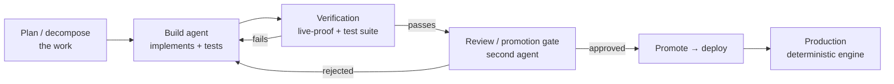

# Agentic Engineering — how I ship and operate production software with AI agents

I build and run a live, paid production product ([lastingground.com](https://lastingground.com)) largely by **orchestrating AI coding agents** (Claude Code + OpenAI Codex) as a small, disciplined engineering team — with the review gates, verification, and architectural judgment that make agent output trustworthy enough to put in front of paying customers.

This repo documents that operating model and backs it with **runnable, synthetic-data demonstrations** of the patterns I use:

- [`evals/`](evals/) — an eval harness that gates AI-produced output before it ships (deterministic checks + a rubric tier + a CI gate + a drift check), on a toy synthetic dataset.
- [`skill/`](skill/) — an authored **Agent Skill** (`SKILL.md` with progressive disclosure + a bundled script).
- [`mcp/`](mcp/) — a tiny **MCP server** exposing tools over a synthetic dataset.

> **What's here and what isn't.** Everything in this repo is synthetic and generic — a clean-room demonstration of *patterns*, not my product. The product's source-acquisition pipeline (how specific records are discovered, accessed, and normalized) is its competitive moat and is deliberately absent. The point of this repo is to make the *engineering practice* legible, not to ship the proprietary part.

---

## The operating model

I treat agents the way a tech lead treats a team: clear roles, a defined hand-off, and nothing reaches production without passing a gate.

- **Two roles, one hand-off.** One agent does build + data work in the canonical repo; a second acts as the **review / promotion / deploy gate**. Capability is built *behind* the gate and only becomes customer-visible after it passes — so the live product never silently degrades when an upstream source changes.
- **The agent loop, made explicit.** Every unit of work runs *gather context → take action → verify the work → repeat*. The "verify" step is not optional — it's where most of the value (and safety) is.
- **Verification before ship ("live-proof").** Before a capability is promoted, it's exercised against real, live sources and a test suite, and the actual outputs are inspected — not just unit tests with mocked responses. This is eval-driven development applied to a production data product.
- **Context engineering, not just prompting.** Sub-agents with isolated context windows for parallel work; just-in-time retrieval; compaction and durable notes so long-running work survives context limits.
- **High agency, bounded by gates.** The agents move fast; the gates and verification keep them honest. I keep human (my) judgment on the irreversible, outward-facing, and trust-sensitive decisions.

The judgment — architecture, what to trust, what to keep proprietary, what's safe to tell a customer — is mine. The agents are a force multiplier that lets one person ship and operate something that normally takes a team.

---

## The decision that matters most: where I *don't* use a model

My product engine is **deterministic**. The compliance-critical answers (flood zone, insurance, zoning) never pass through a language model. In a domain next to insurance and lending, an answer has to be **reproducible and traceable to an official source every time** — so the model stays out of the hot path and the sources speak for themselves. In production terms, the LLM sits *outside the critical path*; the customer-facing answer comes from a deterministic, fail-closed path with an independent enforcement gate.

I use AI agents to **build and operate** the system. The system itself does not gamble a customer's flood determination on a model. Knowing where AI belongs — and where it doesn't — is the senior judgment the whole product rests on, and it's the same judgment I'd bring to a team putting agents into production.

---

## A real bug the verification caught

Mocked unit tests prove code *runs*; only verification against live data proves it's *right*. A concrete example from my own engine: a proximity feature was reporting distances roughly 35% too large, because it measured in Web Mercator *grid* units rather than true ground distance (Web Mercator isn't equidistant — the error grows with latitude). Every unit test passed, because the mocks used the same flawed frame. The verification-before-ship step, run against real coordinates, is what exposed it. The fix was a one-line latitude correction plus a regression test that now fails without it.

That gap — green tests, wrong answer — is exactly why a verification gate, not just unit tests, belongs between an agent's output and production.

## Concepts this repo demonstrates

| Concept | Where | What "doing it well" looks like |
|---|---|---|
| Eval-driven development | [`evals/`](evals/) | the harness gates the build like unit tests; deterministic + rubric tiers; drift sampling |
| Agent Skills | [`skill/`](skill/) | `SKILL.md` with progressive disclosure; a bundled script for the parts that need deterministic reliability |
| MCP (Model Context Protocol) | [`mcp/`](mcp/) | a server exposing typed tools; clear tool boundaries (an agent can tell *which* tool to use) |
| Multi-agent orchestration | this README | workflows vs. agents; review/promotion gates; sub-agent context isolation |
| Deterministic boundary | this README | keep the model out of the compliance hot path; fail-closed; independent enforcement gate |

## Run the demonstrations

Each subdirectory is self-contained with its own README and quickstart. The eval harness and MCP server run on synthetic data with **no API keys required** (the rubric/LLM-judge tier is stubbed so the suite is reproducible in CI).

---

[lastingground.com](https://lastingground.com) · [Portfolio](https://sulmusic2-star.github.io/) · [hello@lastingground.com](mailto:hello@lastingground.com)
